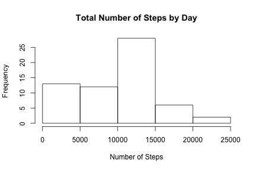
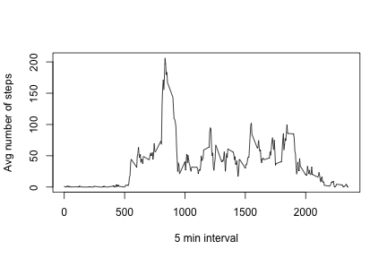
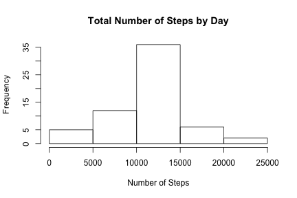
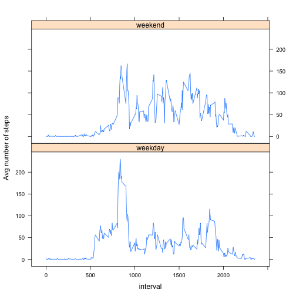

Reproducible Research: Peer Assessment 1
========================================
Created by Yuyi Cheng, Dec 2015

It is now possible to collect a large amount of data about personal movement using activity monitoring devices such as a Fitbit, Nike Fuelband, or Jawbone Up. These type of devices are part of the “quantified self” movement – a group of enthusiasts who take measurements about themselves regularly to improve their health, to find patterns in their behavior, or because they are tech geeks. But these data remain under-utilized both because the raw data are hard to obtain and there is a lack of statistical methods and software for processing and interpreting the data.

This assignment makes use of data from a personal activity monitoring device. This device collects data at 5 minute intervals through out the day. The data consists of two months of data from an anonymous individual collected during the months of October and November, 2012 and include the number of steps taken in 5 minute intervals each day.

## Loading and preprocessing the data
Dataset: Activity monitoring data [52K]

Global settings:

```r
library(knitr)
library(dplyr)
opts_chunk$set(echo = TRUE, cache= TRUE)
options(scipen = 1)
```
Find the zip file (download the file if it doesn't exist in the current working directory) and unzip it. Load the data into dataset "activity".  

```r
if (!("activity.zip" %in% dir())){
        download.file('http://d396qusza40orc.cloudfront.net/repdata%2Fdata%2Factivity.zip','activity.zip')
}
activity = read.csv(unzip("activity.zip"))
summary(activity)
```

```
##      steps                date          interval     
##  Min.   :  0.00   2012-10-01:  288   Min.   :   0.0  
##  1st Qu.:  0.00   2012-10-02:  288   1st Qu.: 588.8  
##  Median :  0.00   2012-10-03:  288   Median :1177.5  
##  Mean   : 37.38   2012-10-04:  288   Mean   :1177.5  
##  3rd Qu.: 12.00   2012-10-05:  288   3rd Qu.:1766.2  
##  Max.   :806.00   2012-10-06:  288   Max.   :2355.0  
##  NA's   :2304     (Other)   :15840
```
From the above summary, we can find three variables included in this dataset:
-steps: Number of steps taking in a 5-minute interval (missing values are coded as NA)
-date: The date on which the measurement was taken in YYYY-MM-DD format
-interval: Identifier for the 5-minute interval in which measurement was taken

## What is mean total number of steps taken per day?
### 1. Calculate the total number of steps taken per day

```r
total.steps = summarize(group_by(activity,date), sum(steps, na.rm = T))
colnames(total.steps) <- c('date','steps')
head(total.steps)
```

```
## Source: local data frame [6 x 2]
## 
##         date steps
##       (fctr) (int)
## 1 2012-10-01     0
## 2 2012-10-02   126
## 3 2012-10-03 11352
## 4 2012-10-04 12116
## 5 2012-10-05 13294
## 6 2012-10-06 15420
```

```r
summary(total.steps)
```

```
##          date        steps      
##  2012-10-01: 1   Min.   :    0  
##  2012-10-02: 1   1st Qu.: 6778  
##  2012-10-03: 1   Median :10395  
##  2012-10-04: 1   Mean   : 9354  
##  2012-10-05: 1   3rd Qu.:12811  
##  2012-10-06: 1   Max.   :21194  
##  (Other)   :55
```

### 2. Make a histogram of the total number of steps taken each day

```r
hist(total.steps$steps, main = 'Total Number of Steps by Day', xlab = 'Number of Steps')
```

 

### 3. Calculate and report the mean and median of the total number of steps taken per day

```r
mean.total.steps <- mean(total.steps$steps)
median.total.steps <- median(total.steps$steps)
```
The mean of the total number of steps taken per day is 9354.2295082, and the median is 10395.

## What is the average daily activity pattern?
### 1. Make a time series plot of the 5-minute interval (x-axis) and the average number of steps taken, averaged across all days (y-axis)

```r
average.steps = summarise(group_by(activity,interval), mean(steps,na.rm = T))
colnames(average.steps) <- c('interval','steps')
plot(average.steps$interval, average.steps$steps, type = 'l', xlab = '5 min interval', ylab = 'Avg number of steps')
```

 

### 2. Which 5-minute interval, on average across all the days in the dataset, contains the maximum number of steps?

```r
max.interval <- average.steps[which.max(average.steps$steps),]
```
Interval 835 contains the maxium number of steps, which is 206.1698113.

## Imputing missing values
### 1. Calculate and report the total number of missing values in the dataset 

```r
num.missing <- sum(!complete.cases(activity))
```
There are 2304 missing values in the dataset.

### 2. Devise a strategy for filling in all of the missing values in the dataset. 
Here, I'd like to use the mean for that 5 min interval to fill in the missing values. 

### 3. Create a new dataset that is equal to the original dataset but with the missing data filled in.

```r
is.missing <- !complete.cases(activity)
new.activity <- activity 
new.activity$steps[is.missing] <- average.steps$steps[match(activity$interval[is.missing], average.steps$interval)]
head(new.activity)
```

```
##       steps       date interval
## 1 1.7169811 2012-10-01        0
## 2 0.3396226 2012-10-01        5
## 3 0.1320755 2012-10-01       10
## 4 0.1509434 2012-10-01       15
## 5 0.0754717 2012-10-01       20
## 6 2.0943396 2012-10-01       25
```

```r
summary(new.activity)
```

```
##      steps                date          interval     
##  Min.   :  0.00   2012-10-01:  288   Min.   :   0.0  
##  1st Qu.:  0.00   2012-10-02:  288   1st Qu.: 588.8  
##  Median :  0.00   2012-10-03:  288   Median :1177.5  
##  Mean   : 37.38   2012-10-04:  288   Mean   :1177.5  
##  3rd Qu.: 27.00   2012-10-05:  288   3rd Qu.:1766.2  
##  Max.   :806.00   2012-10-06:  288   Max.   :2355.0  
##                   (Other)   :15840
```
The new dataset is stored in "new.activity".

### 4. Make a histogram of the total number of steps taken each day and Calculate and report the mean and median total number of steps taken per day. 

```r
new.total.steps <- summarise(group_by(new.activity,date), sum(steps, na.rm = T))
colnames(new.total.steps) <- c('date','steps')
mean.new.total.steps <- mean(new.total.steps$steps)
median.new.total.steps <- median(new.total.steps$steps)
```

```r
hist(new.total.steps$steps, main = 'Total Number of Steps by Day', xlab = 'Number of Steps')
```

 

The mean total number of steps taken per day for the new dataset with imputed data is 10766.1886792 and the median is 10766.1886792.

### Do these values differ from the estimates from the first part of the assignment? What is the impact of imputing missing data on the estimates of the total daily number of steps?

```r
compare <- data.frame(mean = c(mean.total.steps,mean.new.total.steps), 
                      median = c(median.total.steps,median.new.total.steps))
rownames(compare) <- c('Original Dataset','New Dataset')
compare
```

```
##                      mean   median
## Original Dataset  9354.23 10395.00
## New Dataset      10766.19 10766.19
```
To compare the original dataset and the new one, it is not difficult to find that after imputing missing data, the mean equals to the median for the new dataset, while the original dataset has different values for mean and median. 

## Are there differences in activity patterns between weekdays and weekends?
### 1. Create a new factor variable in the dataset with two levels – “weekday” and “weekend” indicating whether a given date is a weekday or weekend day.

```r
new2.activity <- new.activity
wkday <- weekdays(as.Date(new2.activity$date))
wkday[wkday == 'Sunday' | wkday == 'Saturday'] <- 'weekend'
wkday[!wkday == 'weekend'] <- 'weekday'
new2.activity <- cbind(new2.activity,wkday)
head(new2.activity)
```

```
##       steps       date interval   wkday
## 1 1.7169811 2012-10-01        0 weekday
## 2 0.3396226 2012-10-01        5 weekday
## 3 0.1320755 2012-10-01       10 weekday
## 4 0.1509434 2012-10-01       15 weekday
## 5 0.0754717 2012-10-01       20 weekday
## 6 2.0943396 2012-10-01       25 weekday
```

```r
summary(new2.activity)
```

```
##      steps                date          interval          wkday      
##  Min.   :  0.00   2012-10-01:  288   Min.   :   0.0   weekday:12960  
##  1st Qu.:  0.00   2012-10-02:  288   1st Qu.: 588.8   weekend: 4608  
##  Median :  0.00   2012-10-03:  288   Median :1177.5                  
##  Mean   : 37.38   2012-10-04:  288   Mean   :1177.5                  
##  3rd Qu.: 27.00   2012-10-05:  288   3rd Qu.:1766.2                  
##  Max.   :806.00   2012-10-06:  288   Max.   :2355.0                  
##                   (Other)   :15840
```
The new factor variable is called "wkday" in the dataset "new2.activity".
### 2. Make a panel plot containing a time series plot (i.e. type = "l") of the 5-minute interval (x-axis) and the average number of steps taken, averaged across all weekday days or weekend days (y-axis). 

```r
average2.steps = summarise(group_by(new2.activity,interval,wkday), mean(steps,na.rm = T))
colnames(average2.steps) <- c('interval','wkday','steps')
library(lattice)
xyplot(steps~ interval | wkday, data = average2.steps, layout = c(1,2), type = 'l', ylab = 'Avg number of steps')
```

 
